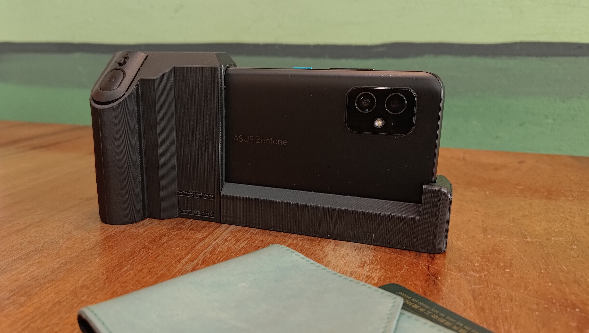
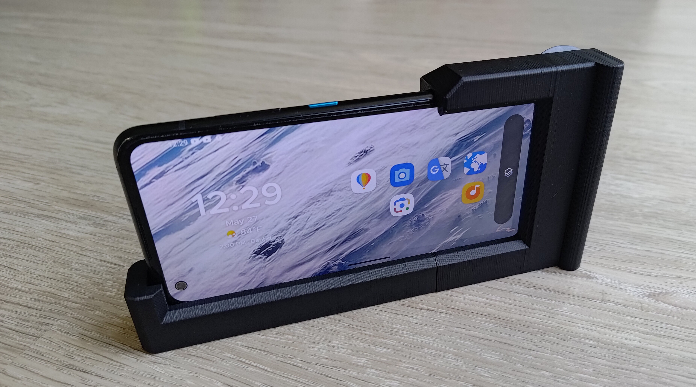
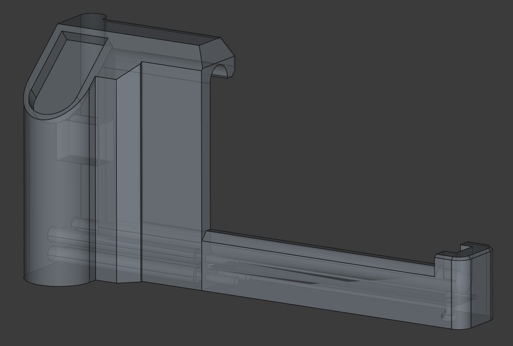

# 📸 KidiCam – KIDs' Intelligent Camera
KidiCam is a DIY smart camera designed to inspire creativity and curiosity in children. By repurposing an old smartphone and utilizing 3D-printed components, you can create a kid-friendly camera that encourages exploration and learning.

## 🎯 Motivation
The KidiCam project aims to provide children with a tool that is both educational and fun. The custom-designed grip is tailored for small hands, ensuring that even a 4-year-old can hold the camera comfortably and securely.

## 🚀 Features
* Capture & Share: Empower kids to take photos of their surroundings and share their perspectives.
* Interactive Learning: Utilize Google Lens to identify objects, learn names, pronunciations, and gather information instantly.
* Creative Expression: Encourage storytelling and description skills as children explain their photographs.
* Encouraging Focus and Patience: When your child uses KidiCam, they learn to slow down and pay attention to details—waiting for the right moment to take a photo, holding the camera steady, and thinking about what they see. These simple actions help build their ability to focus, be patient, and develop mindful observation skills—all important traits for learning and emotional growth.

## 🛠️ Hardware and Accessories
The 3D model is designed around the Asus Zenfone 8 [[Specs]](https://www.asus.com/mobile-handhelds/phones/zenfone/zenfone-8/techspec/). And also needs the following accessories:
* Bluetooth remote shutter: a stock Bluetooth shutter for mobile phone [[Specs]](https://www.momoshop.com.tw/TP/TP0001385/goodsDetail/TP00013850000727?categoryCode=4200700384&sourcePageType=4).
* A steel ruler: the project uses a 15 cm stainless steel ruler as a pin. The length, width and thickness are 165 mm, 13.5 mm and 0.65 mm respectively. This ruler aligns the main and lower parts and enforces the overall rigidness.
* Screws: 5 round head screws. The diameter of head is 5 mm, and the diameter and length of the thread part are 3 mm and 11 mm respectively.

## ✏️ Build Your Own Camera UI

To be updated soon.

## 📁 3D Model
The whole frame consists of two parts:
* The main part (the grip and shutter socket) [[Download STL]](/model/zenfone8_cameraCase_v1p2-Body_right_handler.stl)
* The lower part [[Download STL]](/model/zenfone8_cameraCase_v1p2-Body_left_frame.stl)

## 📚 Getting Started
1. Print the 3D Components: Use the provided STL files to print the main grip and lower support.
2. Assemble the Frame: Attach the printed parts to form the camera housing.
3. Insert Smartphone: Place your smartphone into the assembled frame.
4. Install Necessary Apps: Ensure Google Lens or similar apps are installed for object recognition.
5. Start Exploring: Hand over the KidiCam to your child and let the adventure begin!

## ☕ Buy Me a Coffee
https://buymeacoffee.com/kidicam
