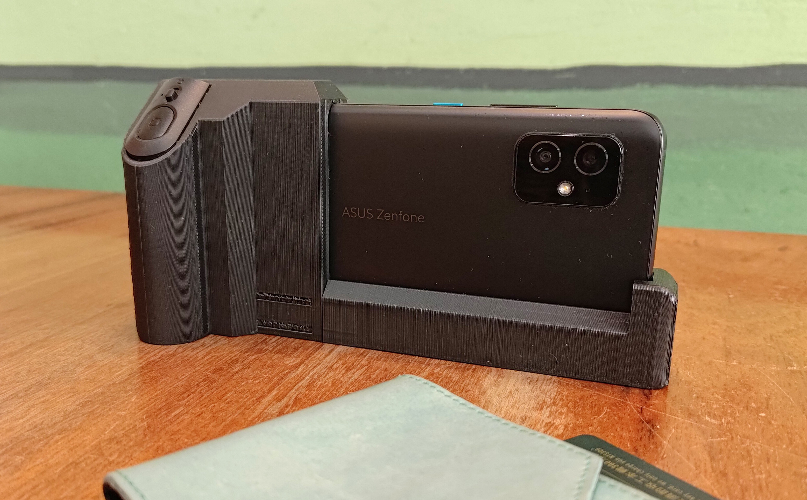

# KidiCam - KIDs' Intelligent Camera
Expolore the world with photos and DidiCam.

## Motivation

The size of grip is also smaller and specially designed for younger kids. My 4+ year-old kid can easily and stably hold the phone.

## Usage

### Take photos and share ideas
Let you kids take photos and share the things intertest them and know how to describe them.

### Learn the new things
When kids are wondering what the things are, like names or pronunciations, they can use Google Lens to take photos and then get all the information immediately.

## 3D model
The whole frame consists of two parts, the main (grip and shutter) and the lower parts.
+ Main part: [link](/model/zenfone8_cameraCase_v1p2-Body_right_handler.stl)
+ Lower part: [link](/model/zenfone8_cameraCase_v1p2-Body_left_frame.stl)

## Hardware
The 3D model is based on Asus Zenfone 8. And also needs the following accessories:
+ Bluetooth remote shutter: a stock Bluetooth shutter for mobile phone [link](https://www.momoshop.com.tw/TP/TP0001385/goodsDetail/TP00013850000727?categoryCode=4200700384&sourcePageType=4).
+ A steel ruler: a 15cm stainless steel ruler. The length, width and thickness are 16.5 13.5 and 0.65 cm respectively. This ruler connect the main and lower parts and enforces the overall rigidness.
+ Screws: 5 round head screws.

## Buy me a coffee ☕︎
https://buymeacoffee.com/kidicam
